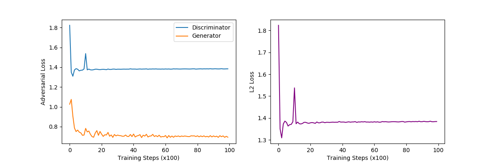
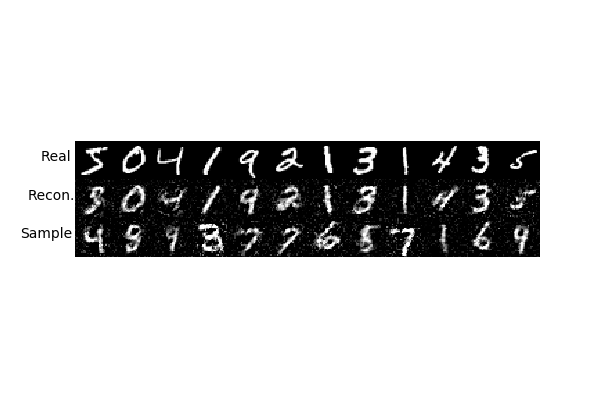
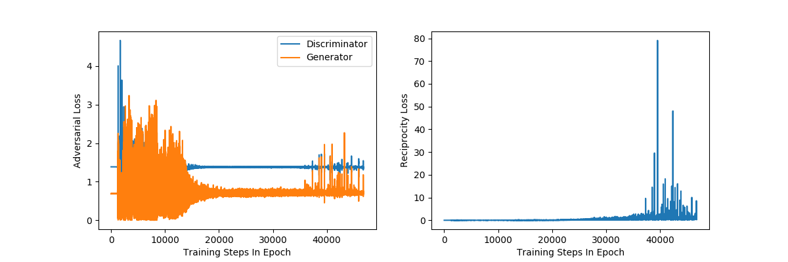
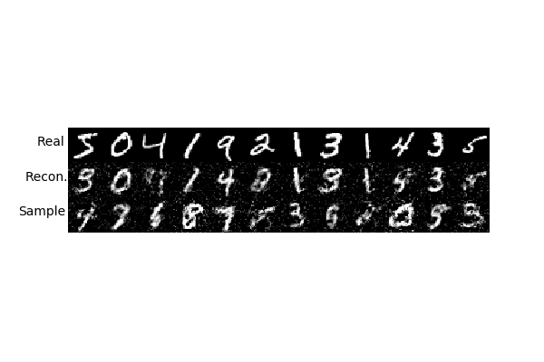

# ALAE Implentations for Pytorch and Tensorflow 1&2 on MNIST Digits

The following are the result from the MLP archictures described in [Adversarial Latent Autoencoders](https://arxiv.org/abs/2004.04467) by Pidhorskyi *et al.* (2020).

Training match the hyper-parameters described in the paper, with gamma=0.1 as left unspecified.

### PyTorch

### Tensorflow v1 

### Tensorflow v2 

